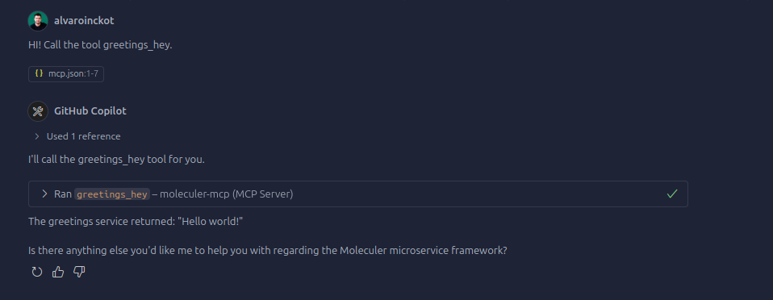

# moleculer-mcp

> A Model Context Protocol (MCP) server that exposes [Moleculer.js](https://github.com/moleculerjs/moleculer) actions as AI tools.

## 📋 Overview

Moleculer-MCP acts as a bridge between the [Model Context Protocol (MCP)](https://modelcontextprotocol.io/introduction) and [Moleculer.js](https://github.com/moleculerjs/moleculer) microservices. It automatically exposes all your Moleculer service actions as MCP tools, enabling AI agents to seamlessly interact with your Moleculer services.
